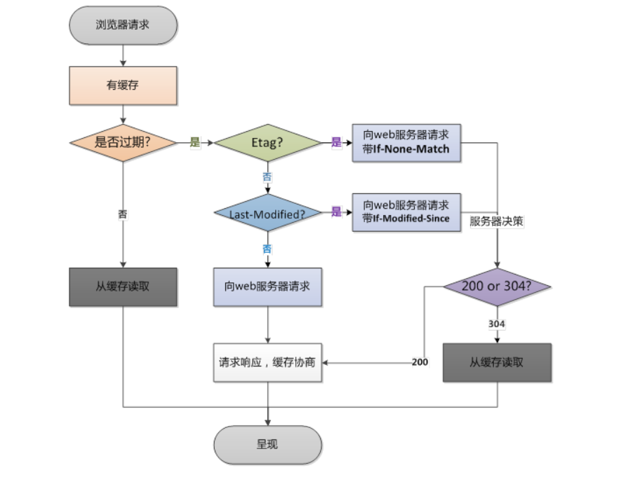

## 一、为什么使用缓存

不缓存的话每次加载同一个且未被修改过的网页，都要浪费时间，浪费流量去加载。有了缓存的话，就可以用本地缓存显示

## 二、缓存什么内容？

缓存内容是一些不常修改的文件，例如，html，css，js等这些要用到，且很少修改的文件 

## 三、怎么实现缓存

在http里面通过请求头响应头来实现

### 3.1HTTP缓存头部字段

- cache-control	请求/响应头，缓存控制字段，缓存不缓存他说了算
  - no-store：所有内容都不缓存
  - no-cache：缓存，但是浏览器使用缓存前，都会请求服务器判断资源是否最新
  - max-age = x(单位秒)请求缓存后的x秒不在发起请你去
  - s-maxage=x：代理服务器请求源站缓存后的x秒不在发起请求，只对CDN缓存有效
  - public：客户端和CDN都可以缓存
  - private：只有客户端可缓存
- Expires 响应头，代表资源过期时间，服务端返回的，HTTP1.0的属性，与max-age共存下，优先级低
- Last-Modified 响应头，资源最新修改时间，服务器告诉浏览器
- if-Modified-Since 请求头，资源最新修改时间，浏览器告诉服务器，和上面是一对，两个会进行对比
- Etag 响应头，资源标识，由服务器告诉浏览器，文件唯一标识
- if-None-Match 请求头，缓存资源标识，由浏览器告诉服务器，和Etag是一对，他两个会进行对比

### 3.2HTTP缓存工作方式

#### 场景一：让服务器与浏览器约定一个文件过期时间——Expires

- 浏览器第一次请求文件，服务端返回文件并返回Expireres过期时间
- 在改时间内，就不要重新发起请求
- 时间过期了，重新发起 

缺点：

- 约定过期时间Expires时间到，但是请求文件未经修改、
- 还是要重新发起请求，不够智能
- 所以有了场景二

#### 场景二：让服务器与浏览器在约定文件过期时间的基础上，加一个文件最新修改时间的对比——Last-Modified与if-Modified-Since

- 浏览器向服务器请求资源，服务器返回 **资源**+**Expires**+**Last-Modified**
- 情况一：Expires时间没到，就用本地缓存
- 情况二：Expires时间到了，浏览器就用if-Modified-Since进行对比
  - 一样，则用本地缓存，并返回304
  - 不一样，服务器返回最新资源+Expires+Last-Modified

#### 场景三：在场景二的基础上加上文件唯一标识符Etag

- 第一次请求，服务器返回Expires+资源+Etag
- 再次加载资源的时候，会用if-None-Match进行对比
- 如果文件未作修改，那么Etag是不会改变的，就直接使用缓存资源

上面三种方式都有一个缺陷，就是文件发生修改了，但是Expires未到期，就无法请求最新的新资源。所以对缓存的方案进一步作出改进

### 3.3缓存改进方案

####  改进一：md5/hash缓存

- 为静态文件添加MD5或者hash表示，解决浏览器无法跳过缓存过期时间主动感知文件变化问题

#### 改进二：CDN缓存

内容分发网，依靠部署在各地边缘的服务器，通过中心平台的负载均衡、内容分发、调度等功能模块，使得用户就近获取所需内容，降低网络拥塞，提高用户访问响应速度和命中率

## 四、内容协商机制

