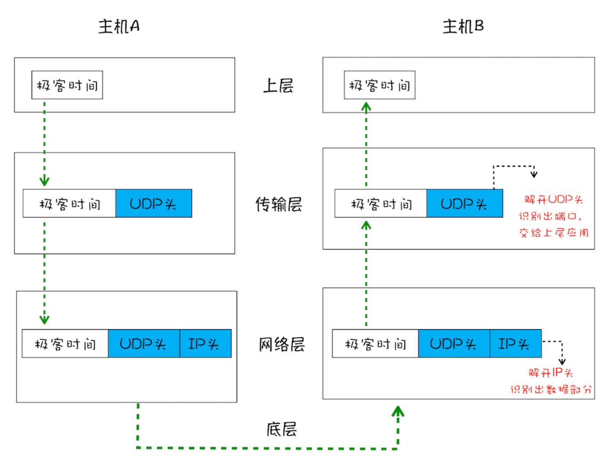
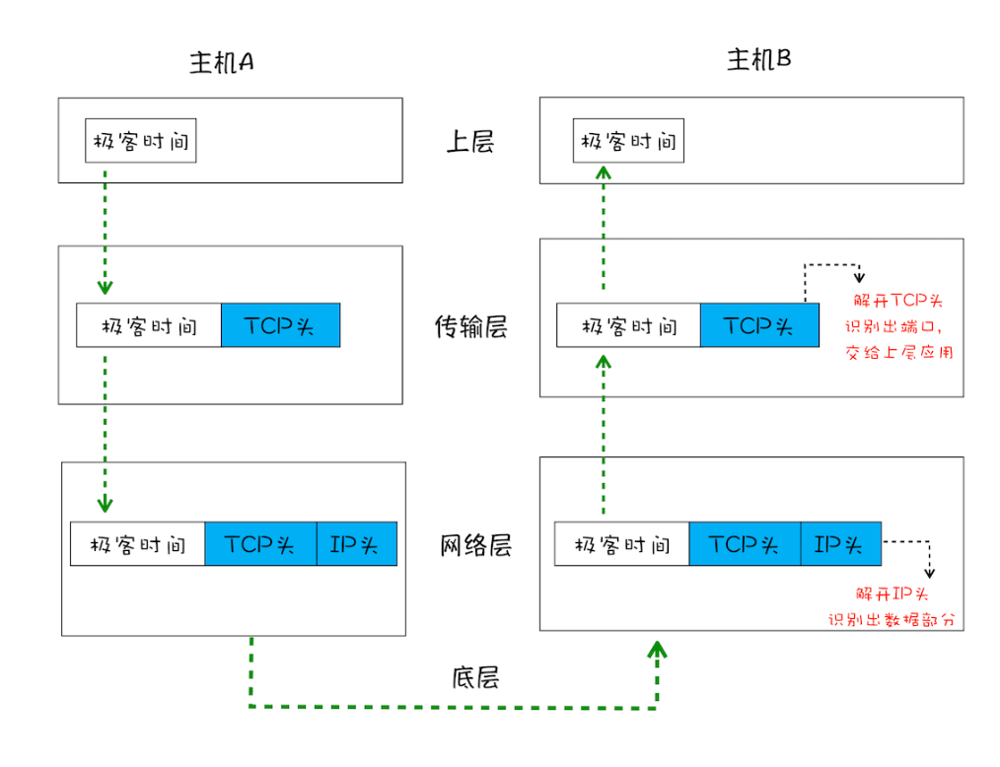

### 1.IP网络传输协议

数据包从主机A到主机B三层协议模型

- 把数据包送到主机

```
1.A的上层将数据包，传给A网络层（数据+IP头）
2.A网络层将IP头附加到数据包上，组成新的IP数据包，交给底层。
3.底层通过物理网络将数据包传输给主机B
4.数据包被传输到主机B的网络层，在这里主机B拆开数据包的IP头信息，将拆开来的数据部分上交给上层
```


### 2.UDP把数据包送给应用

- IP协议较为底层，只负责把数据给电脑，但是不知道交给那个程序
- 基于IP协议上，有了UDP（**用户数据包协议**）
- UDP最重要的是端口号，通过端口号把数据给到指定程序

UPD就是四层网络模型了，多了传输层：



```
A:
1.上层将含有“极客时间”的数据包交给传输层；
2:传输层会在数据包前面加上UDP头，组成新的UDP包，再讲新的UDP数据包交给网络层；
3.网络层再将IP头附加到数据包上，组成新的IP数据包，并交给底层；
B:
1.数据包达到主机B的网络层，在这里主机B拆开IP头信息，将拆开的数据部分交给传输层；
2.在传输层，数据包中的 UDP头被拆开，并根据UDP中所提供的端口号，并把数据部分交给上的应用程序；
```

在使用UDP发送数据时，有各种因素使数据包出错，虽然UDP可以校验数据是否正确，但对于错误的数据包，UDP并不提供重发机制，只是丢弃当前的包，而且UDP在发送之后也无法知道是否能达到目的地。

**虽然UDP不可靠，但是速度非常快，所以UDP应用于对数据完整性不高的场景：视频，游戏等**

#### 3.TCP：把数据完整的送达程序

- 对于浏览器请求，邮件等这类数据要求数据可靠性应用，使用UDP带来两个问题：
  - 数据包传输过程丢失
  - 大文件被拆分，小数据包经过不同路由，并在不同时间到达接受端，UDP不知道如果去组装数据包，无法把数据包还原成完整的文件
- 相对于UDP，TCP是面向连接的，可靠的，基于字节流的，有两个特点：
  - 对于数据包丢失，TCP可以重新传
  - TCP有数据包排序机制，可以把乱序的数据包还原成完整的文件



**TCP与UDP传输的过程是差不多的，但是TCP头部信息保证了，一大块数据传输的完整性。**

**首先，建立连接阶段**。这个阶段是通过“三次握手”来建立客户端和服务器之间的连接。 TCP 提供面向连接的通信传输。**面向连接**是指在数据通信开始之前先做好两端之间的准 备工作。所谓**三次握手**，是指在建立一个 TCP 连接时，客户端和服务器总共要发送三个 数据包以确认连接的建立。

**其次，传输数据阶段**。在该阶段，**接收端需要对每个数据包进行确认操作**，也就是接收端 在接收到数据包之后，需要发送确认数据包给发送端。所以当发送端发送了一个数据包之后，在规定时间内没有接收到接收端反馈的确认消息，则判断为数据包丢失，并触发发送端的重发机制。同样，一个大的文件在传输过程中会被拆分成很多小的数据包，这些数据包到达接收端后，接收端会按照 TCP 头中的序号为其排序，从而保证组成完整的数据。

**最后，断开连接阶段**。数据传输完毕之后，就要终止连接了，涉及到最后一个阶段“四次 挥手”来保证双方都能断开连接。

