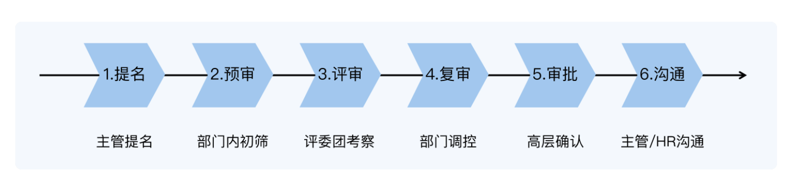
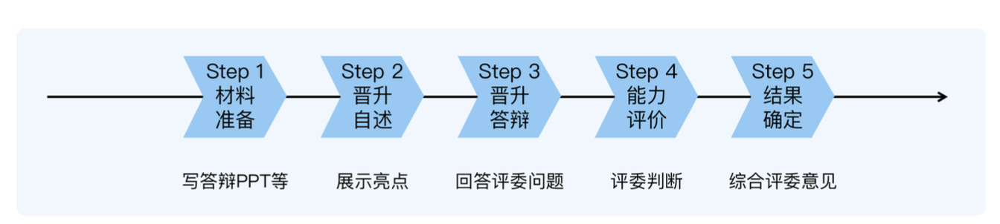

## 一、晋升体系

### 1.晋升流程

- 一次完整的晋升流程，一般有6个步骤

1. 提名阶段:主管决定要不要提名你去参加晋升。
2. 预审阶段:部门对提名的名单进行预审，如果你跟其它竞争者 PK 失败，就失去了晋升 机会。
3. 评审阶段:评委团对你进行评审，考察你的能力有没有满足要求。
4. 复审阶段:部门对评审结果进行复审，确认你的晋升结果。
5. 审批阶段:复审的结果上报高层审批，审批通过之后，你的晋升结果就最终确定了。
6. 沟通阶段:主管或 HR 跟你沟通晋升结果。

#### 提名

- **绩效合格**
- **年限条件**
- **附加条件**：专利之类的
- **红线条件**

#### 评审

- 该阶段是最为核心的，需要向评委**展示自己的实力**，接受他们的考察

- 整个过程和面试相似，先写PPT，面对评委团进行自述，展示自己的亮点
- 讲完之后，会有多个评委通过问答的方式对你考察

### 2.晋升原则

#### 主动原则：主动做事

**不要以为leader会主动帮你搞定晋升**

- leader的行事风格是多种的，关心的侧重点是不一样的：
  - 有的关心业务是否达成，会经常与产品沟通交流
  - 有点关心团队形象，对外承诺的事不能延期，不能出问题。重视进度、质量、风险等情况的跟进和监控
  - 有的关心自己职位的爬升，所以团队成员对他是一种可以利用的资源
- **如果遇到不关心自己成长的leader**
  - 不要等着他分配任务，不然长期干活就是个工具人
- **关注组员成长的leader**
  - 得注意他的判断和你的不一致，他认为你应该继续在当前岗位上锻炼，而你觉得应该尝试新的挑战
    - 如果这时候不去主动沟通，就还会继续做当前熟悉的任务

**不要被动接收信息**

自己以为吧本质工作做好就够了，其他事情自然有对应的人去负责，因此很少去主动了解很多工作相关的信息，有些东西对技术人来说不属于他们的职责范畴，但是在晋升的时候，它却是评判技术人综合能力的重要考察内容：

- **业务功能上线后业务效果如何？**
- **业务效果不好的可能原因是什么？**
- **整个业务机房的部署结构是怎么样的？**

这些信息，有的需要找产品运营要数据，有的需要跟业务负责人探讨，有的需要和另外团队交流，都需要主动去找机会才有可能获取的。

第一，主动找leader沟通工作。

不管leader是什么风格都应该定期或者不定期找他沟通工作任务的想法和意愿。一方面听听他对自己的看法，获取指导性建议；另一方面，可以获取更多关于团队、业务的信息，有机会的情况下尽量主动承担有挑战性的工作。

第二，主动找人沟通，了解更多信息。

不要害怕问别人问题，评委很可能会问到，“上线效果如何”，“新加坡机房如何与美国同步”

#### 成长原则：不断挖掘成长点

- 不要以为事情做得多就能晋升，要做更有挑战的事。
- 事情做得好不代表能晋升，可能会绩效好，但不代表你拥有下一阶段的能力。
- 晋升不光要看功劳和苦劳，还得注意**个人成长**

**做法**：

- 现有的工作可以得心应手的完成，应该尝试更高难度，更复杂的事情。
  - 业务开发熟练后，可以考虑完成方案设计，架构设计，架构重构，系统优化的工作
- 不管事情做的好不好，都应该多做**复盘总结**，找到**可以优化的点**。
  - 对于踩了坑，犯了错的事，必须复盘，毕竟教训的印象是深刻的
  - 事情做的顺利，也要复盘，主动挖掘其中的成长点，否则会失去很多成长的机会

#### 

#### 价值原则：学习为公司产出价值的技能

我们应该尽量不要把时间花费在学习工作上用不到的技能上，比如编译原理、操作系统，算法等。从**晋升角度考虑**，学习的这些技能无法为公司创造价值，这几个月的时间白白浪费掉了。

晋升的话会考虑到个人**能力级别**和**公司价值**，大部分人只关注能力级别，而忽略了公司价值这个点。

这两个点其实就是**晋升**和**面试**的最大区别。面试的时候面试官只能考察你的能力级别，但是在晋升的时候，不论你把能力吹的有多天花乱坠，如果不能体现在对公司价值的实际产出上，那一切都是废话。

#### **总结**：

1. 第一条原则是主动原则，主动做事的人，比等着别人安排的人更容易晋升。所以你应该 定期或者不定期地主动找主管沟通，交流关于工作任务的想法和意愿，寻求机会;同 时，你也要主动找同事沟通，了解更多工作相关信息。
2. 第二条原则是成长原则，一边做事一边挖掘成长点、提升自己能力的人，比光顾着做事 的人更容易晋升。所以如果你已经能得心应手地完成现在的任务，就应该主动跳出舒适区，尝试更高难度和更高复杂度的事情;同时，不管事情做好了还是没做好，你都应该
    多做复盘总结，找到可以提升优化的点

3. 第三条原则是价值原则，让能力为公司产出价值的人，比空有一身能力的人更容易晋 升。所以，如果你的时间很宝贵，就应该优先学能为公司产出价值的技能。

### 3.如何判断能力有没有达到晋升要求

自己信心慢慢，但是只要leader，老板，评委只要有一个不认可就倒下了。那要什么样的能力才会经得起不同评审这和不同视角的考核，才能顺利的晋升呢？

**误区**：

- 不要以为绩效好就能晋升，他只是其中一分部的能力。
- 不要以为工作年限久就能晋升

**晋升逻辑**

- **提前做下一级别的事情**
  - 比如P6升7就需要带过小团队（3-5人）
- 做好当前级别的事情
  - **只有把当前级别的事情做好了，才有机会晋升**。
  - 可能只是有当前级别的基础，不一定熟练或者精通
  - 只有精通当前级别的事情才可以晋升，就像星耀里面只有星耀1才能打晋级赛，而星耀5不行

#### **基础、熟练和精通的区别**

**基础意味着会做**。能独立自主的完成。

**熟练意味着做好**。体现在做事实践，掌握了做事的最佳实践，保证了效率与质量。

**精通意味着优化**。采取不同思维、方式和工具去做同样的事情，获取突破。

#### 通用的晋升步骤

1. 按照晋升原则的指导，在当前级别拿到比较好的结果，为公司创造价值，同事把当前几倍要求做到精通（从P6-到P6+），这样晋级撒才稳。
2. 达到精通之后，对照下一级别的要求来提升自己的各种能力（到了P6+的时候，按照P7-去要求自己）
3. 主动寻找工作机会，尝试做下一个级别的事情，继续拿好的结果，向leader证明你具备下一级别的能力
4. 拿到工作结果之后申请晋升，向评委介绍你做过的事情，展示相关的能力和结果，证明自己具备了下一级别要求的能力

#### 小结

1. 晋升的第一条逻辑是，在当前级别做下一级别事情的人，才有机会晋升。
2. 晋升的第二条逻辑是，只有把当前级别的事情做好了，才有机会晋升。
3. 基础、熟练和精通三种水平的区别是，基础意味着会做，标志是能够独立完成;熟练意 味着做好，标志是掌握最佳实践;精通意味着优化，标志是创造新的经验。
4. 通用的晋升步骤是，先把当前级别要求的能力提升到精通水平，接着按照下一级别的能力要求继续提升，然后主动寻找工作机会，尝试下一个级别的工作，最后拿着工作成果 申请晋升。

### 4.抽象能力具体化

P7 的要求是“具备系统思考的能力，能够全面掌握某个技术领域”，而 P8 的要求 是“具备前瞻判断的能力，能够规划技术领域的发展方向”。

这根本看不懂，不知道要我们干嘛。什么是**系统思考**能力?P7 才要求系统思考，可是我 P6 的时候参与项目开发，就需要考 虑需求的合理性、索引设计高性能、接口的兼容性和易用性、上线的灰度方案这么多事 情，这些难道不是系统思考吗?

什么是**前瞻判断**能力?P6 要预测需求变化，P7 要规划团队技术发展，这些也是前瞻判 断呀，为什么 P8 要特别强调前瞻判断?