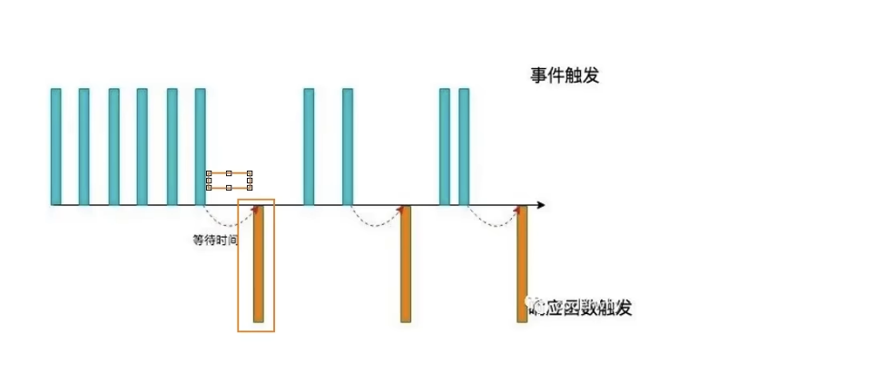

### 1.Promise控制并发


### 2.debounce

- 当事件连续触发时，在规定的时间内没有触发，才去执行
- 场景：input事件，搜索，提交信息，频繁点击按钮，监听鼠标滚定，resize



- 核心逻辑：
  - 接收callback和delay，返回一个函数
  - 在delay事件到了的时候，执行回调函数。
  - 如果时间没到，需要重新计时，也就是clearTimeout，然后重新给一个定时器，时间到了没触发再执行
- 注意事项：
  - 内部的函数定义不要用箭头函数，否则绑定this有问题，因为内部的函数作为一个独立函数调用了
- 扩展逻辑：
  - 如果延迟5秒钟，但是3秒钟的时候就退出这个页面了，就没必要发送请求，就需要取消功能
  - 拿到定时器，直接clearTimeout

```js
function debounce(fn, delay, immediate = false) {
  // 1.定义一个定时器, 保存上一次的定时器
  let timer = null;
  let isInvoke = false;

  // 2.真正执行的函数
  const _debounce = function (...args) {
    // 取消上一次的定时器
    if (timer) clearTimeout(timer);

    // 判断是否需要立即执行
    if (immediate && !isInvoke) {
      fn.apply(this, args);
      isInvoke = true;
    } else {
      // 延迟执行
      timer = setTimeout(() => {
        // 外部传入的真正要执行的函数
        fn.apply(this, args);
        isInvoke = false;
        timer = null;
      }, delay);
    }
  };

  // 封装取消功能
  _debounce.cancel = function () {
    if (timer) clearTimeout(timer);
    timer = null;
    isInvoke = false;
  };

  return _debounce;
}

```


### 3.节流throttle

- 当事件触发时，会执行这个事件的响应函数
- 如果这个事件会被频繁触发，那么节流函数会按照一定的频率来执行函数
- 不管在这个中间有多少次触发，执行函数的频率总是固定的
- 场景：监听鼠标滚动移动，用户频繁点击，游戏中的设计

```javascript
// 最后一集 47min
function throttle(fn, interval, options = { leading: true, trailing: false }) {
  // 1.记录上一次的开始时间
  const { leading, trailing } = options;
  let lastTime = 0;
  let timer = null;

  // 2.事件触发时, 真正执行的函数
  const _throttle = function () {
    // 2.1.获取当前事件触发时的时间
    const nowTime = new Date().getTime();
    // 如果是第一次不执行，则lastTime=nowTime，remainTime就>0,第一次不执行了
    if (!lastTime && !leading) lastTime = nowTime;

    // 2.2.使用当前触发的时间和之前的时间间隔以及上一次开始的时间, 计算出还剩余多长事件需要去触发函数
    const remainTime = interval - (nowTime - lastTime);
    if (remainTime <= 0) {
      // 走到里面正常执行，则需要清除定时器，防止fn执行两遍
      if (timer) {
        clearTimeout(timer);
        timer = null; // timer设置为null，不然后面的定时器无法添加
      }

      // 2.3.真正触发函数
      fn();
      // 2.4.保留上次触发的时间
      lastTime = nowTime;
      return; // return 防止下面添加定时器
    }

    // 如果最后一次需要执行，当之前没有定时器时，需要添加一个定时器，防止remainTime间隔没到时没执行throttle，而导致没执行fn
    if (trailing && !timer) {
      timer = setTimeout(() => {
        timer = null;
        lastTime = !leading ? 0 : new Date().getTime(); // 重点：有首次触发时，
        fn();
      }, remainTime); // 使用remainTime作为定时器时间，比如throttle的interval=10s，13s是最后一次触发，那remainTime=7s，这样到20s就可以执行最后一次
    }
  };

  return _throttle;
}

```

### 4.Promise.all

```javascript
function myPromiseAll(promises) {
    // 问题关键: 什么时候要执行resolve, 什么时候要执行reject
    return new HYPromise((resolve, reject) => {
      const values = []
      promises.forEach(promise => {
        promise.then(res => {
          values.push(res)
          if (values.length === promises.length) {
            resolve(values)
          }
        }, err => {
          reject(err)
        })
      })
    })
  }

 function allSettled(promises) {
    return new HYPromise((resolve) => {
      const results = []
      promises.forEach(promise => {
        promise.then(res => {
          results.push({ status: PROMISE_STATUS_FULFILLED, value: res})
          if (results.length === promises.length) {
            resolve(results)
          }
        }, err => {
          results.push({ status: PROMISE_STATUS_REJECTED, value: err})
          if (results.length === promises.length) {
            resolve(results)
          }
        })
      })
    })
  }
```

