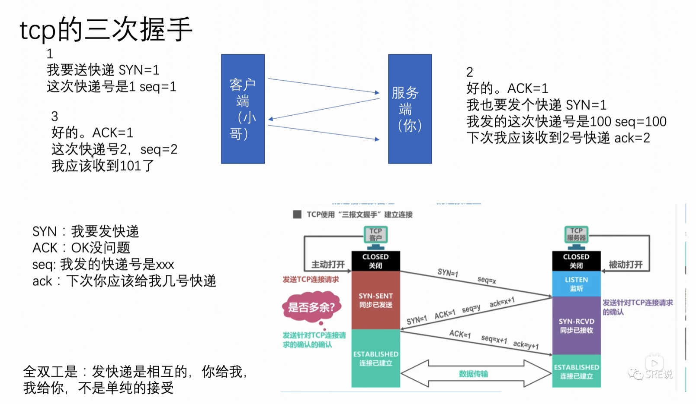

## 一、浏览器

### 1.输入URL到展示页面发生了什么？

```
1.首先判断这个URL是否合法（如何判断URL是否合法），如果不合法，则使用这个字符串进行搜索
2.判断是否资源有无缓存，有缓存则直接返回该资源，否则进入网络请求，第一步则需要DNS解析
3. DNS解析，把域名解析成IP地址（2.2）	
4. 为了请求资源，客户端和服务端建立TCP连接
5.SSL/TLS四次握手（只有https才有这一步）
3. 客户端发起HTTP请求
4. 服务器处理请求并返回数据
5. 浏览器接收数据并解析
6. 断开连接
```

### 2.HTML、CSS、JavaScript如何渲染页面

```
1.
```


## 二、网络

### 1.TCP三次握手



```
1.TCP三次握手的目的： 确保服务端和客户端都有发送和接受数据的能力、
2.tcp三次握手的流程：
	1.首先客户端发送SYN（请求建立连接，一般为1），和seq=x随机序列号到服务端，目的是告诉服务端想建立连接，并且告诉服务端我下一次接受确认序列号应该是多少
	2.服务端收到第一次的数据，并且发送ACK、SYN、seq=y、ack=x+1
	3.客户端收到第二次握手的数据并且发送ACK，seq=x+1，ack=y+1、
SYN：我要建立连接
ACK：没问题，可以进行连接
seq：数据包的序列号，标识
ack：下次对方应给我发送的序列号，值等于上一次的接受到的序列号+1
```

### 2.什么是DNS

```
概念：DNS（Domain Name System）是域名系统的英文缩写，是一个层次化、分散化的互联网连接资源命名系统，用于 TCP/IP 网络。
DNS的作用：
	1.识别主机的方式有主机名（域名）和IP地址；人类喜欢语义化的主机名，对于底层的计算机世界来说，它们更容易理解这个IP地址。为了同时满足人类和机器，所以我们需要一个能力：将主机名解析成IP地址的能力。那么DNS的作用就是这个，可以协助人类更方便地访问互联网
DNS解析流程：两种方式，递归和迭代
	1.首先在本地缓存中查找对应的IP
	2.递归查询：
		1.本地输入域名后，向本地域名服务器查询IP，如果没有，那本地域名服务器会向根域名服务器查询=>根向定居域名服务器查询
		2.如果在过程中查询到，然后由查询的末端层层返回到用户的主机
	3.迭代查询：
		1.本地主机向本地域名服务器发起递归查询
		2.本地域名服务器发起迭代查询，向根域名服务查询IP
		3，根域名服务器告诉本地域名服务器，下次应向顶级域名服务器查询的IP
		4.本地域名服务器向顶级域名服务器发起查询
		。。。
		5.某次中查到了，域名服务器将查询结果告诉本地域名服务器，然后本地域名服务器告诉本地主机
		
from：https://juejin.cn/post/7065238621866950693?searchId=20240417214723A331972EF5414F405A0A
```

### 3.什么是SSL/TSL

```
TSL: 传输层安全性协议 (Transport Layer Security) 前身是：安全套接层 (Secure Sockets Layer）

TLS目的/背景/解决的问题：
	1.目的是建立安全连接，保证数据的机密性和完整性
	2.
```
### 3.HTTPS加密过程

```
	1.客户端发起HTTPS请求
	2.服务端接收到HTTPS请求，在服务端创建好公钥私钥，并将包含私钥的数字证书发送给客户端
	3.客户端验证数字证书通过后在本地生成用于对称性加密的秘钥
	4.然后再客户端用服务端发送过来的公钥加密自己生成的密钥，发送给服务端
	5.之后双方的通信，都使用这个密钥来加密和解密数据
```


