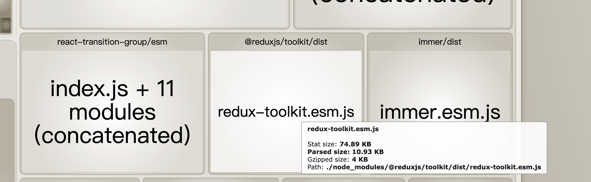
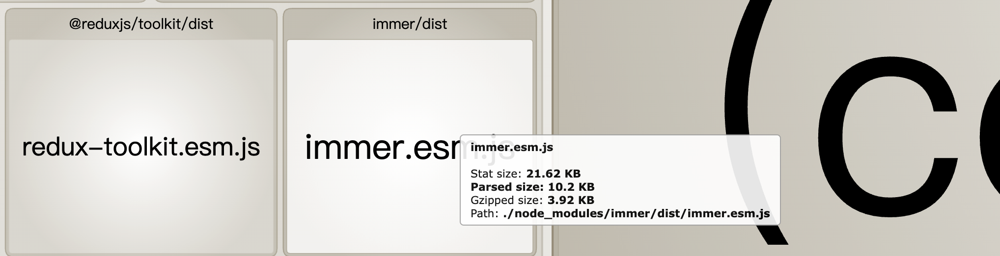

### 1.ES6转ES5具体方法/流程

```
使用Babel，Babel可以看做是JS的编译器，可以将ES6及以上的代码转换为低版本的JS，这样可以兼容不支持该特性的浏览器和环境。它主要帮我们做一些语法转换，源代码转换，Polyfill等一些列的操作。不过现在开发过程中项目模板中会帮我们配置好，普通开发很少会去接触Babel，但是现在Babel对于前端来说是不可或缺的，我们学习和掌握背后的原理是有利于我们理解代码从编写到上线的流程。

如何使用/配置：
	1.安装babel-core（核心模块，负责解析转换生成目标代码，需要依赖预设） babel-preset-env（可以根据目标浏览器版本去按需转换，如const，箭头函数的转换） babel-plugin-transform-runtime（减少冗余代码，会生成公共函数只保存一份，减少体积，提高性能）依赖
	2.在.babelrc中选择指定版本浏览器
	3.整体配置按照标准配置即可，没有什么复杂的配置
	
Babel原理：
	1.我的理解是Babel帮我们做一些类似编译器的工作，将我们编写的源码转换为另一种可被浏览器识别源码。
	2.代码执行流程是 源代码 => AST => 字节码 => 被V8引擎执行处理。
	3.Babel主要是处理ES6+生成的AST，负责把ES6+的AST转为ES5的AST，然后再根据ES5的AST生成ES5的代码。
	4.Babel处理的流程是：
		1.源代码经过词法分析生成Tokens数组，然后遍历tokens数组，语法分析（识别到关键字如let就知道这里是个变量，根据符号知道这里是不是要初始化箭头函数等等）生成ES6的AST
		2.遍历（深度优先）ES6的AST，遍历访问的过程中使用插件对代码进行转换，比如箭头函数转为普通函数ArrowFunctionExpression =>FunctionExpression
		3.访问完节点并用插件修改后就生成了新的ES5的AST
		4.根据ES5的AST 生成 ES5 的代码
		
参考插件：
	1.plugin-transform-arrow-functions 箭头函数转换
	2.plugin-transform-block-scoping let/const转换
		
from：https://coderqmj.github.io/pages/Webpack/%E5%AD%A6%E4%B9%A0%E7%AC%94%E8%AE%B0.html#_6-3babel-%E5%BA%95%E5%B1%82%E5%8E%9F%E7%90%86
```

### 2.为什么要用RTK





```
1.Redux ToolKit是官方推荐的编写Redux逻辑的方法，目的是简化开发流程，减少样板代码，提高开发效率。本质上是对Redux进行了二次封装。
2.我们这个运营端，需要维护一定的状态，比如哪些地域，哪些实例族，哪些机型，是否境外等等一系列的数据与状态，用一开始使用useState和react-query去维护状态和请求数据，这样让UI组件变的非常臃肿。使用了RTK后我们可以将数据请求和状态维护都放在redux的Slice切片文件里，使得代码结构简洁，逻辑清晰，易于维护。而且上手成本低，RTK易于配置，用了很少的配置就能达到以前写Redux的效果。
3.轻量配置化的RTK，极少的成本就能使用Redux，大大提高了团队的开发效率；使得项目的可维护性变高

3.包体积？
	gzipped size：4kb 服务器传输的size
	Stat size: 74kb
	Parsed size：浏览器解析后的代码大小

4.使用thunk还是saga？区别？优缺点？
```

### 3.项目资源很大，如何尽快显示第一屏页面

```
页面加载角度考虑
```

### 4.从客户端和服务端角度说一下鉴权（用 cookie 讲故事）

```
node jwt讲一下
### 2.怎么管理页面版本

```
1.控制台

2.云霄：
	0.点击Header里面的产品按钮，触发监听事件去加载不同的产品的js和css文件
	1.首先根据当前产品的key，去获取productInfo
	2.然后产品信息里面有js和css资源，然后去加载该资源
```


```

### 


## Gate

### 1.多语言如何处理？如何优化？有什么问题？

```
1.我们是使用next里面的 useTranslation，从'next-i18next'导入的
原理：
	1.用户请求当前页面
	2.Next命中路由规则
	3.会去检测当前语言
	4.加载对应的翻译文件
	5.返回翻译内容
命名空间：
	1.需要传入命名空间，我们一般以业务区分，fiat，p2p，dw之类的
	2.根据你当前的语言+命名空间，会去找到locals里面的文件，比如 'public/locals/en/p2p.json'
t函数工作原理：
	1.JSON格式的翻译文件
	2.传入t中的key，可以去上面找到的json中找到对应的翻译的值，并且返回这个值
注入上下文
	1.appWithTranslation，会给整个App共享i18next的上下文
语言切换：
	1.用户切换语言时，路径变了，zh/变为en/
	2.i18next会检测到的，然后他就会重新加载翻译文件
	3.组件重新渲染，显示新的文本
	
优点：
1.有利于SEO，不同语言都有对应的URL
2.性能好，当前语言，只加载当前语言的翻译文件，
	解释1：构建后翻译文件变异到JS bundle中，存在CDN或者静态服务器文件上，然后通过请求动态加载的
	
缺点：
1.需要自己提交文案，并且key和value一一对应，效率低
2.开发的阶段，填入key，没有对应的翻译，开发体验较差
3.有的时候，会忘记key，遗漏key
	
文案如何管理：
	1.文案放到一个git仓库里面的json，提交的时候，输入的时候，提供一个key和英文value
	2.提交上去后，把对应的key给到翻译团队，让翻译处理，完成后拉取对应的翻译。
	3.再跑脚本到自己的业务项目
	4.脚本原理：
		1.3个参数：
			1.参数1: 需要执行的json文件，比如next_p2p
			2.参数2: 生成的文件命名，比如p2p，它就会在对应的语言的目录下生成p2p.json文件
			3.参数3: 文件生成到哪个目录，自己对应的业务locales下面

如何优化：
	优化1: 使用脚本扫描出需要翻译的文案，并输出新增的key，无需手动一个一个查找复制
```

### 2.优化翻译流程

```
1.获取本地已经翻译的key
2.
```

